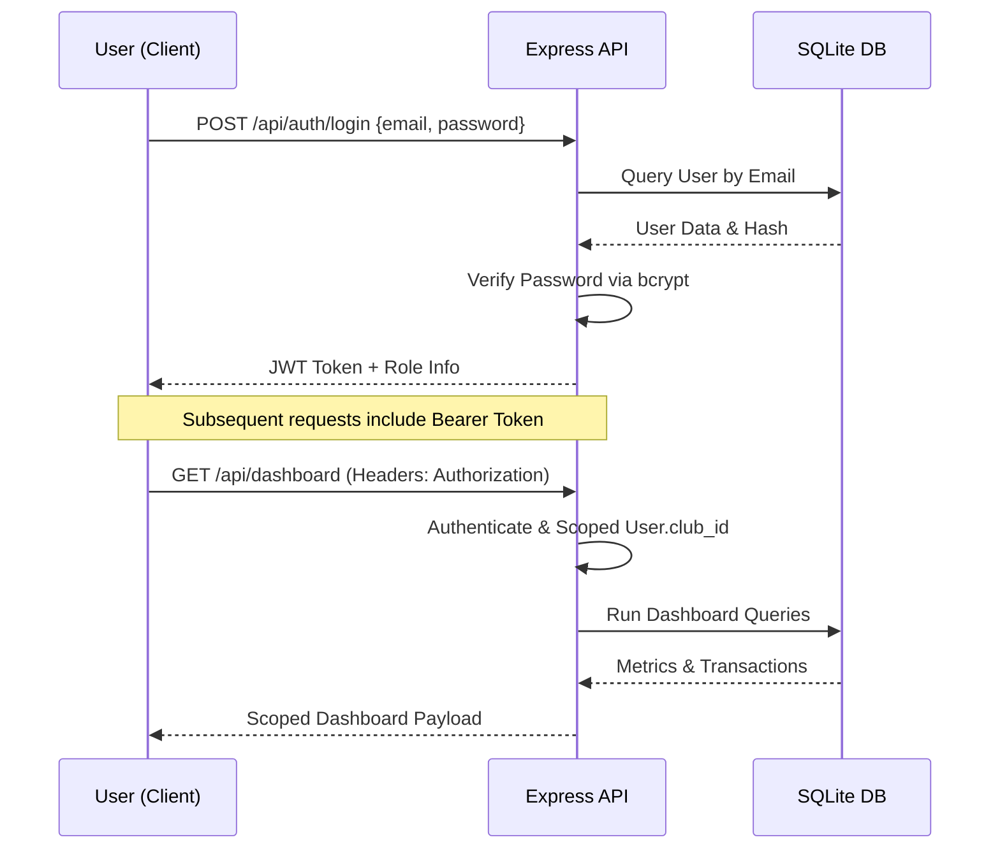
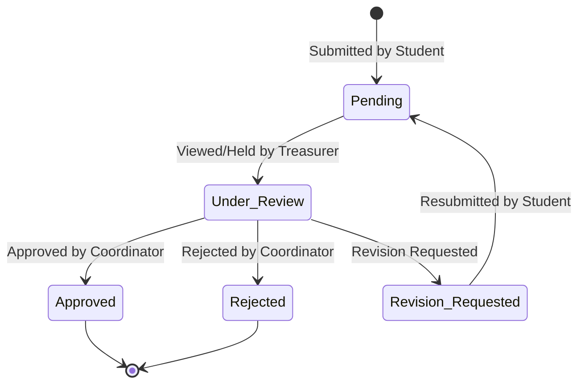

# Architecture Diagrams

The following diagrams illustrate the core interaction flows within SparkClub.

## Authentication and Dashboard Loading

```mermaid
sequenceDiagram
    participant User as User (Client)
    participant API as Express API
    participant DB as SQLite DB
    
    User->>API: POST /api/auth/login {email, password}
    API->>DB: Query User by Email
    DB-->>API: User Data & Hash
    API->>API: Verify Password via bcrypt
    API-->>User: JWT Token + Role Info
    
    Note over User, API: Subsequent requests include Bearer Token
    
    User->>API: GET /api/dashboard (Headers: Authorization)
    API->>API: Authenticate & Scoped User.club_id
    API->>DB: Run Dashboard Queries
    DB-->>API: Metrics & Transactions
    API-->>User: Scoped Dashboard Payload
```

## Financial Approval Workflow

```mermaid
stateDiagram-v2
    [*] --> Pending : Submitted by Student
    Pending --> Under_Review : Viewed/Held by Treasurer
    Under_Review --> Approved : Approved by Coordinator
    Under_Review --> Rejected : Rejected by Coordinator
    Under_Review --> Revision_Requested : Revision Requested
    Revision_Requested --> Pending : Resubmitted by Student
    Approved --> [*]
    Rejected --> [*]
```
