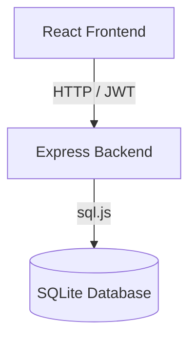

# System Overview

SparkClub is built on a modern 3-layer architecture tailored for high performance, ease of local hosting, and robust security.

## Core Layers
1. **Frontend Presentation Layer**: Powered by React, Vite, Tailwind CSS, and Recharts. It handles the UI/UX, states, and client-side data calculations.
2. **Backend Services Layer**: Powered by Node.js, Express, and JSON Web Tokens. It contains business logic, database controllers, route validation, middleware, and external API wrappers.
3. **Data Persistence Layer**: Powered by SQLite3 (`sql.js`). This provides instant, serverless, file-based persistence that works natively in development environments without setup.

